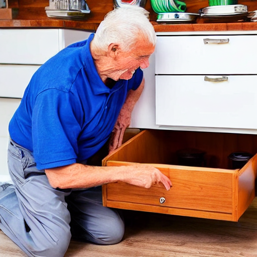

# Interactive_Action
This is the code for our submission
Download the Stable Diffusion and run the bash script:

```
bash run.sh
```
# Results will be updated from time to time
## More generated results
### move


## More qualitative 
### pick up


### move


### pull out



